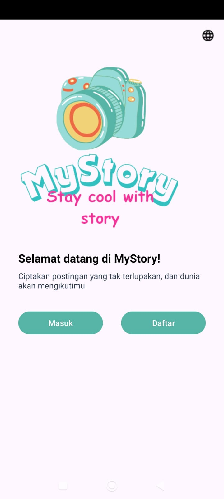
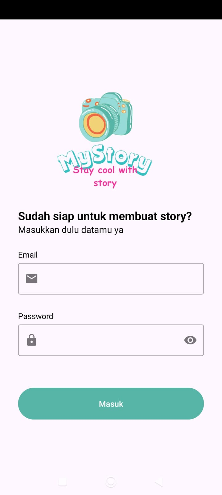
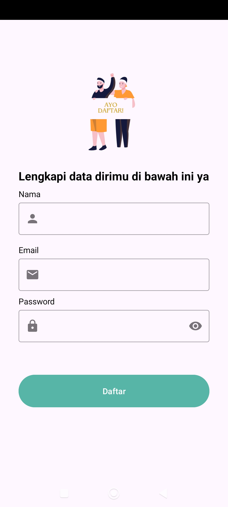
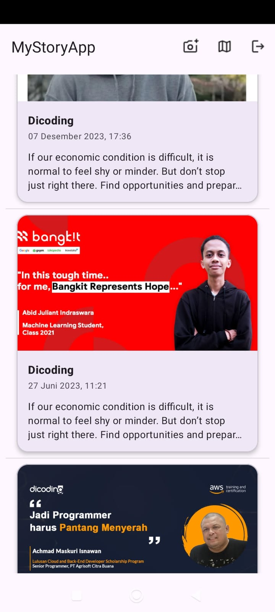
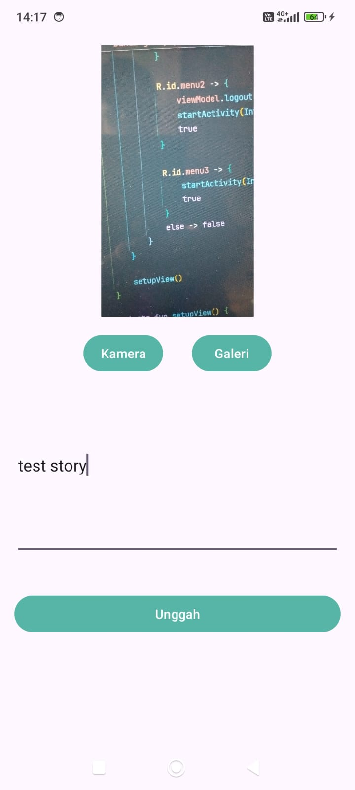
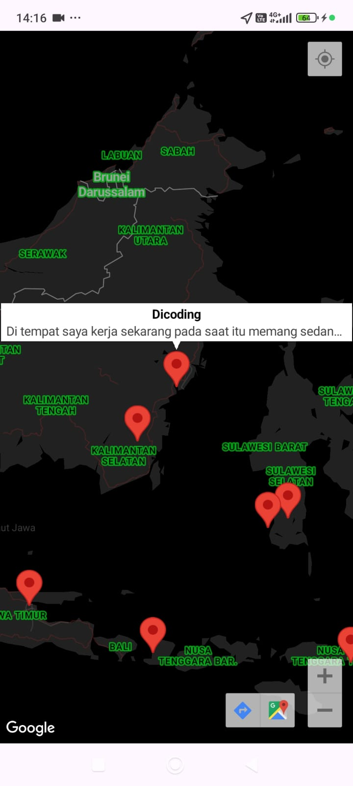

# 📖 StoryApp

> An Android application for discovering, viewing, and sharing stories with location-based content.

StoryApp is an Android application that allows users to register and log in, browse stories shared by other users, view story details, upload stories with images, and explore available story locations through an interactive map.

This project was built as part of my Android development learning journey, focusing on REST API integration, authentication, session management, image handling, pagination, Google Maps integration, and unit testing.

---

## 📱 Screenshots

### 🏠 Welcome



### 🔐 Login



### 📝 Sign Up



### 📚 Story Feed



### 📖 Story Detail


### 📤 Upload Story



### 🗺️ Story Map



## Demo Video
[▶️ Watch Demo on YouTube](https://youtube.com/shorts/Nty3znbkyqA?si=svfsSev8AWASPVKl)

## ✨ Features

### 🔐 User Authentication

- User registration
- Login and logout
- Persistent user session

### 📚 Story Feed

- Browse stories shared by users
- Paginated story loading
- View story details

### 📸 Create Story

- Upload stories with images
- Add story descriptions
- Image processing before upload

### 🗺️ Story Map

- View stories that contain location data
- Display available story locations on Google Maps
- Explore the geographical locations of stories shared by users

> **Note:** Location data is displayed on the map only when it is available in the story data received from the API. The current story creation flow does not send location data when uploading a new story.

### 💾 Session Management

- Store authentication state using DataStore Preferences
- Maintain the user's login session

### 🎨 User Experience

- Custom UI components
- Loading and error states
- Remote image loading
- Responsive Android layouts

---

## 📋 Project Information

| | |
|---|---|
| **Platform** | Android |
| **Language** | Kotlin |
| **Minimum SDK** | API 23 |
| **Target SDK** | API 33 |
| **Compile SDK** | API 37 |
| **JDK** | 17 |
| **Architecture** | MVVM |
| **Version** | 1.0 |
| **Testing** | JUnit, Mockito |

---

## 🛠️ Tech Stack

### Core

| Technology | Version | Purpose |
|---|---:|---|
| **Kotlin** | — | Primary programming language |
| **Android SDK** | API 37 | Application development |
| **Java** | 17 | JVM target |
| **View Binding** | — | Type-safe view access |

### Android & Architecture

| Technology | Version | Purpose |
|---|---:|---|
| **AndroidX Lifecycle** | 2.11.0 | ViewModel and LiveData |
| **AndroidX Navigation** | 2.9.8 | Navigation between screens |
| **Paging 3** | 3.5.0 | Paginated story loading |
| **DataStore Preferences** | 1.2.1 | User session management |
| **Material Components** | 1.14.0 | UI components |

### Networking & Media

| Technology | Version | Purpose |
|---|---:|---|
| **Retrofit** | 3.0.0 | REST API communication |
| **Gson Converter** | 2.9.0 | JSON serialization/deserialization |
| **OkHttp Logging Interceptor** | 5.4.0 | HTTP request/response logging |
| **Glide** | 5.0.9 | Image loading |
| **Google Maps SDK** | 20.0.0 | Story location visualization |
| **ExifInterface** | 1.4.2 | Image metadata handling |

### Testing

| Technology | Version | Purpose |
|---|---:|---|
| **JUnit** | 4.13.2 | Unit testing |
| **Mockito** | 5.23.0 | Mocking dependencies |
| **AndroidX Core Testing** | 2.2.0 | LiveData testing |
| **Kotlin Coroutines Test** | 1.11.0 | Coroutine testing |
| **Espresso** | 3.7.0 | Android UI testing |

---

## 🏗️ Project Structure

The project is organized into several packages based on their responsibilities, separating data handling, dependency injection, utilities, custom UI components, and application screens.

```text
app/
└── src/
    └── main/
        └── java/
            └── com/
                └── dicoding/
                    └── picodiploma/
                        └── loginwithanimation/
                            │
                            ├── custom/
                            │   ├── EmailEditText
                            │   └── PasswordEditText
                            │
                            ├── data/
                            │   ├── pref/
                            │   │   ├── UserModel
                            │   │   └── UserPreference.kt
                            │   │
                            │   └── remote/
                            │       ├── paging/
                            │       │   ├── LoadingStateAdapter
                            │       │   └── StoryPagingSource
                            │       │
                            │       ├── response/
                            │       │   ├── FileUploadResponse
                            │       │   ├── LoginResponse.kt
                            │       │   ├── RegisterResponse
                            │       │   └── StoryResponse.kt
                            │       │
                            │       └── retrofit/
                            │           ├── ApiConfig
                            │           ├── ApiService
                            │           └── ResultState
                            │
                            ├── UserRepository
                            │
                            ├── di/
                            │   └── Injection
                            │
                            ├── utils/
                            │   └── Utils.kt
                            │
                            └── view/
                                ├── detail/
                                │   └── DetailActivity
                                │
                                ├── login/
                                │   ├── LoginActivity
                                │   └── LoginViewModel
                                │
                                ├── main/
                                │   ├── MainActivity
                                │   ├── MainViewModel
                                │   └── StoryAdapter
                                │
                                ├── map/
                                │   ├── MapsActivity
                                │   └── MapsViewModel
                                │
                                ├── signup/
                                │   ├── SignupActivity
                                │   └── SignupViewModel
                                │
                                ├── upload/
                                │   ├── UploadActivity
                                │   └── UploadViewModel
                                │
                                ├── welcome/
                                │   └── WelcomeActivity
                                │
                                └── ViewModelFactory
```
| Package                | Responsibility                                               |
| ---------------------- | ------------------------------------------------------------ |
| `custom`               | Custom UI components such as email and password input fields |
| `data.pref`            | Local user session and preference management                 |
| `data.remote.paging`   | Pagination implementation for story data                     |
| `data.remote.response` | API response models                                          |
| `data.remote.retrofit` | Retrofit configuration, API service, and result handling     |
| `di`                   | Dependency injection and repository setup                    |
| `utils`                | Utility and helper functions                                 |
| `view.detail`          | Story detail screen                                          |
| `view.login`           | User login screen and ViewModel                              |
| `view.main`            | Main story feed and story adapter                            |
| `view.map`             | Google Maps screen and location-related logic                |
| `view.signup`          | User registration screen and ViewModel                       |
| `view.upload`          | Story upload screen and ViewModel                            |
| `view.welcome`         | Initial welcome screen                                       |

### Application Flow
```text

                    ┌─────────────┐
                    │   Welcome   │
                    └──────┬──────┘
                           │
                    ┌──────▼──────┐
                    │ Login /     │
                    │ Sign Up     │
                    └──────┬──────┘
                           │
                    ┌──────▼──────┐
                    │  Story Feed │
                    └───┬────┬────┘
                        │    │
             ┌──────────┘    └──────────┐
             ▼                          ▼
      ┌──────────────┐          ┌──────────────┐
      │ Story Detail │          │ Story Map    │
      └──────────────┘          └──────────────┘
             │
             ▼
      ┌──────────────┐
      │ Upload Story │
      └──────────────┘
```
---
## 🚀 Installation

Follow the steps below to run StoryApp locally.

### Requirements

Before running the project, make sure you have:

| Requirement | Version |
|---|---|
| **Android Studio** | Latest stable version recommended |
| **JDK** | 17 |
| **Android SDK** | API 37 |
| **Minimum Android Version** | API 23 (Android 6.0) |
| **Target Android Version** | API 33 (Android 13) |

### 1. Clone the Repository

Clone the repository using Git:

```bash
git clone https://github.com/JonathanAlzndr/StoryApp.git
```

Navigate to the project directory:

```bash
cd StoryApp
```

### 2. Open the Project

Open the cloned project using **Android Studio**.

Select:

```text
Open
→ StoryApp
```

Wait for Android Studio to finish indexing the project.

### 3. Sync Gradle

Allow Android Studio to synchronize the project and download the required dependencies.

If Gradle synchronization does not start automatically, select:

```text
File
→ Sync Project with Gradle Files
```

Wait until the synchronization process completes successfully.

### 4. Configure Google Maps API Key

StoryApp uses the **Google Maps SDK** to display story locations.

The project uses the **Secrets Gradle Plugin** to keep the Google Maps API key outside the source code.

Create or configure the required local configuration according to the project's Secrets Gradle Plugin setup.

For example:

```properties
MAPS_API_KEY=YOUR_GOOGLE_MAPS_API_KEY
```

Replace `YOUR_GOOGLE_MAPS_API_KEY` with your actual Google Maps API key.

Make sure the required Google Maps API is enabled in your Google Cloud project.

### 5. Connect an Android Device or Emulator

You can run the application using either:

- A physical Android device with USB debugging enabled
- An Android Emulator running API 23 or higher

For an emulator, open:

```text
Android Studio
→ Device Manager
→ Create Device
```

Select a device and Android system image that meets the minimum SDK requirement.

### 6. Build and Run

Select your connected device or emulator in Android Studio.

Then click:

```text
Run
→ Run 'app'
```

or press the **▶ Run** button.

Android Studio will build the project, install the application, and launch StoryApp on the selected device.

---